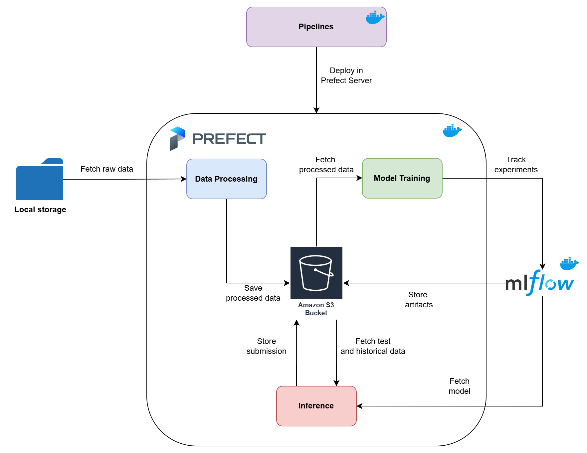

# int20h-2025-xdboobs
Repository for INT20H 2025 Hackathon


## Overview

This repository contains the solution developed for the INT20H'25 hackathon challenge focused on predicting daily transaction risk metrics for merchants. The goal of this project was to build a model that can analyze transactional data and predict risk levels.

Problem Overview:
Merchants often face risks related to fraudulent transactions, financial losses, and other potential issues. The challenge was to create a system that helps predict the risk associated with daily transactions, enabling merchants to take preventive actions and improve decision-making.

Approach:
We approached this problem by building a machine learning pipeline that ingests historical transaction data, preprocesses it for feature engineering, and trains a predictive model using advanced algorithms. The model outputs forecasted daily risk metrics, which can be used by merchants to monitor and assess their transaction activities in real-time.


## Overall Solution




This solution consists of three main pipelines orchestrated by Prefect framework that work together to predict daily transaction risk metrics for merchants. The entire process involves data processing, model training, and inference. Below is a breakdown of each pipeline:

#### 1. **Data Processing Pipeline**
   - **Objective**: The goal of this pipeline is to prepare the raw transactional data and risk event data for model training. We combine historical transaction data with risk event information to generate advanced features that capture key patterns and behaviors related to merchant transactions.
   - **Steps**:
     - **Data Ingestion**: The pipeline ingests transaction data and risk event data from various sources.
     - **Feature Engineering**: A range of advanced feature engineering techniques are applied, such as aggregating transaction data over time, and creating different feature types (time-based features, lagged features etc.).
     - **Data Saving**: Processed data is stored in AWS S3 bucket.

#### 2. **Model Training Pipeline**
   - **Objective**: This pipeline is responsible for training the predictive model that outputs daily transaction risk metrics for merchants.
   - **Model**: We use an **XGBoost** model due to its effectiveness in handling large datasets and its interpretability. The model predicts the risk associated with each merchant's daily transactions.
   - **Hyperparameter Tuning**: To ensure optimal performance, we use the **Optuna** library for hyperparameter optimization. This automated optimization process tunes hyperparameters such as learning rate, depth of trees, and regularization terms to improve model accuracy.
   - **Experiment Tracking**: All model training experiments are tracked using **MLflow**, allowing us to monitor and record the parameters, metrics, and results of each training run for easy comparison and analysis. MLflow stores its artifacts in S3 bucket.

#### 3. **Inference Pipeline**
   - **Objective**: This pipeline is used to predict daily transaction risk metrics for each merchant using the trained model.
   - **Data**: The inference process uses a **sample_submission.csv** file and the processed training dataset. The model predicts the risk metrics for each merchant for the given day, based on the features derived from the input data.
   - **Prediction**: The trained XGBoost model is applied to the daily transaction data to generate the risk predictions. These predictions can be used by merchants to assess and monitor the risk levels associated with their transactions, enabling them to take preventive actions if necessary.


## User Guide

### 1. Clone the Repository

First, clone the repository to your local machine or server:

```bash
git clone https://github.com/poopaandloopa/int20h-2025-xdboobs.git
cd int20h-2025-xdboobs
```

### 2. Set the `.env` File

The `.env` file contains necessary environment variables required for the proper operation of the solution, including configuration for MLflow, AWS, and Prefect. Create a `.env` file in the root of the repository and set the following variables:

```ini
# MLflow configuration
MLFLOW_S3_ENDPOINT_URL= 
MLFLOW_ARTIFACT_ROOT=
MLFLOW_SERVER_FILE_STORE=/mlflow/artifacts
MLFLOW_TRACKING_URI=http://host.docker.internal:5000  # Replace with the correct URL if running on a different host
MLFLOW_TRACKING_URI_DEV=https://8618-95-158-48-155.ngrok-free.app # for dev purposes only

# AWS Configuration (for S3 bucket access)
AWS_DEFAULT_REGION= 
AWS_ACCESS_KEY_ID= 
AWS_SECRET_ACCESS_KEY= 
BUCKET_NAME=

# Prefect Configuration
PREFECT_API_URL=http://host.docker.internal:4200/api
PREFECT_SERVER_ALLOW_EPHEMERAL_MODE=False
```

#### Explanation of the variables:
- **MLFLOW_S3_ENDPOINT_URL**: The URL endpoint for your S3 service (if using AWS or a local instance like MinIO).
- **MLFLOW_ARTIFACT_ROOT**: The root directory where MLflow artifacts will be stored (can be an S3 bucket or local storage).
- **MLFLOW_TRACKING_URI**: The tracking URI for the MLflow server, pointing to your local or hosted instance.
- **MLFLOW_TRACKING_URI_DEV**: For development purposes, this URL will be used for testing and dev environments.
- **AWS_DEFAULT_REGION**: The AWS region where your S3 bucket is located.
- **AWS_ACCESS_KEY_ID**: Your AWS access key ID.
- **AWS_SECRET_ACCESS_KEY**: Your AWS secret access key.
- **BUCKET_NAME**: The name of the S3 bucket for storing models and artifacts.
- **PREFECT_API_URL**: The URL of the Prefect API for managing workflows and pipelines.
- **PREFECT_SERVER_ALLOW_EPHEMERAL_MODE**: Set to `False` to disable ephemeral mode for Prefect server.

### 3. Run Docker Compose

To start the application and services (MLflow, Prefect, etc.), use Docker Compose. This will set up the containers required for the solution:

```bash
docker-compose up --build
```

This will build the containers and start all the services defined in the `docker-compose.yml` file. Make sure that Docker is installed and running on your machine.

### 4. Access the Services

- **MLflow**: Access the MLflow UI via [http://localhost:5000](http://localhost:5000).
- **Prefect**: Access the Prefect UI via [http://localhost:4200](http://localhost:4200).

### 5. Running the Pipelines

Once the containers are up and running, you can execute the data processing, model training, and inference pipelines as follows:

- **Data Processing Pipeline**: This prepares the historical transaction and risk event data.
- **Model Training Pipeline**: This trains the model using XGBoost and tunes hyperparameters with Optuna.
- **Inference Pipeline**: This generates daily risk predictions for each merchant.

These pipelines can be triggered via Prefect workflows, or you can execute them manually by calling the corresponding scripts in the repository (not recommended).

### 7. Troubleshooting

- **Docker-related issues**: If you encounter issues with Docker Compose, ensure that Docker is running and that the images are built correctly.
- **Environment variable issues**: Double-check the `.env` file for any missing or incorrect values.
- **MLflow issues**: Ensure that the MLflow server is running and accessible.
